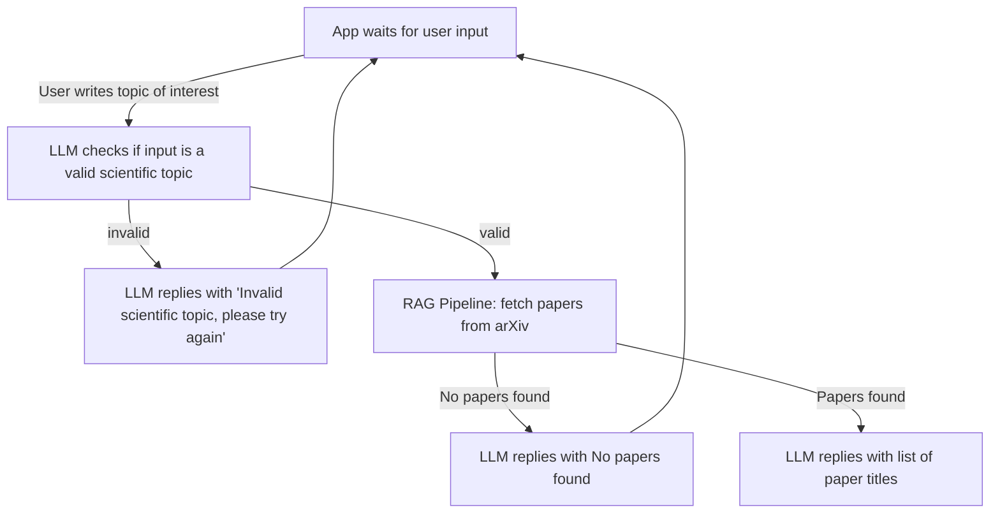
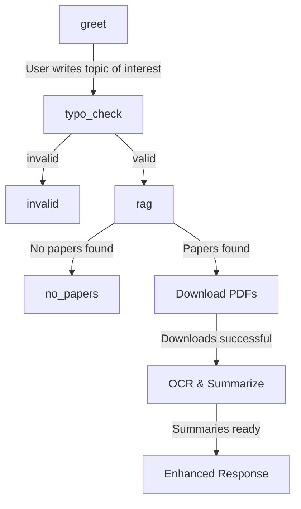

# ScholarSnap

ScholarSnap is an AI-powered research assistant that surfaces the latest research papers from arXiv for a given topic and produces concise, structured summaries using a Retrieval-Augmented Generation (RAG) pipeline backed by a local LLM (Ollama/Mistral).

## Features & Current State

- **LangGraph workflow**: Conversational orchestration with greeting, topic validation, RAG pipeline, and clarification/error handling.
- **Strict topic validation**: LLM checks if the topic is a valid scientific research topic (including anatomical/medical terms) and prompts for re-entry if invalid.
- **Phrase-based arXiv search**: Only returns papers where the full topic phrase appears in the title or abstract, ensuring high relevance.
- **LLM summarization**: Only paper titles are sent to the LLM, which outputs a bullet-point list. No summaries, explanations, or extra text.
- **Frontend chat UI**: Minimal React app with clear error and clarification handling, showing bot and user messages in a chat layout.
- **Ollama integration**: Uses local Mistral model by default, configurable via YAML.
- **Modular codebase**: FastAPI backend with routers/services, React frontend, and centralized config.

## Repository Structure
```
ScholarSnap/
	frontend/                # React + Vite + Tailwind
	no_papers["No papers found"]
			App.tsx              # Chat UI
			main.tsx
			index.css
		package.json
	rag -- "No papers found" --> no_papers
		tailwind.config.js
	backend/
		app/
			main.py              # FastAPI entrypoint, router registration
			config.py            # Configuration loader from YAML
			langgraph_workflow.py# LangGraph workflow orchestration
			routers/
				health.py          # Health check endpoint
				rag.py             # RAG summary endpoint
			services/
				arxiv.py           # arXiv API integration (phrase search)
				llm.py             # Ollama LLM integration & context building
		config.yaml            # Application configuration
		requirements.txt
	README.md
	LICENSE
	.gitignore
```


## Backend API

### `POST /chat/`
Main conversational endpoint. Accepts a user topic and returns a structured response.

**Request Body:**
```json
{ "message": "<topic>" }
```

**Response Fields:**
- `greeting`: Greeting message (string)
- `topic`: The validated topic (string or null)
- `summary`: Bullet-point list of paper titles, or a message if no papers found (string or null)
- `papers`: List of paper objects (array or null)
- `paper_list`: Bullet-point list with titles and authors (string or null)
- `no_papers`: Message if no papers found (string or null)
- `clarification`: Message if topic is invalid (string or null)

**Response Scenarios:**
- Valid topic, papers found: Returns summary, papers, paper_list
- Valid topic, no papers: Returns summary as "No papers found...", empty papers, no_papers message
- Invalid topic: Returns clarification message, all other fields null

---

### `GET /rag/summary?topic=<topic>`
Retrieves recent arXiv papers for a topic and generates a summary.

**Query Parameter:**
- `topic`: The research topic to search for (string)

**Response Fields:**
- `topic`: The topic queried (string)
- `summary`: Bullet-point list of paper titles, or message if no papers found (string)
- `papers`: List of paper objects (array)

---

### `GET /health/`
Health check endpoint.

**Response:**
```json
{ "status": "ok" }
```

# Backend Workflow (LangGraph)




## Configuration

Configuration is managed via `config.yaml`:
```yaml
ollama:
	url: "http://localhost:11434/api/generate"
	model: "mistral:latest"
arxiv:
	api_url: "https://export.arxiv.org/api/query"
	default_days: 7
	batch_size: 5
```

## Installation & Dev Workflow

### Prereqs
- Node 18+ / pnpm or npm
- Python 3.11+
- Ollama installed locally (with model pulled, e.g. `ollama pull mistral`)

### Frontend Dev
```
cd frontend
npm install
npm run dev
```
Opens: http://localhost:5173

### Backend Dev
```
cd backend
python -m venv venv
source venv/bin/activate
pip install -r requirements.txt
uvicorn app.main:app --reload --port 8002
```
Open: http://localhost:8002/docs

## License
MIT

---
ScholarSnap is maintained as a demonstration of applied RAG with local inference. Iterative improvements are ongoing.

## Planned Workflow Enhancements: PDF Download, OCR, and Summarization

To deepen paper analysis, ScholarSnap will incrementally add:

1. **PDF Download Node**: After papers are found, download each paper’s PDF (from arXiv) to a temporary folder.
2. **OCR & Summarization Node**: For each downloaded PDF, extract text (using OCR if needed) and generate a summary of findings using an LLM or dedicated summarizer.
3. **Enhanced Response Node**: Reply with a paragraph for each paper, including title, authors, submission date, and summary of findings.

### Implementation Strategy
- **Incremental Development**: Add one node at a time, testing each thoroughly before moving to the next.
- **Error Handling**: Each node will handle errors gracefully (e.g., skip failed downloads, log issues).
- **Fallbacks**: If OCR or summarization fails, fall back to original metadata (title, authors).
- **Testing**: Unit tests for each new function/node.
- **Logging**: Clear logging at each step for debugging.
- **Feature Flags**: Use config flags to enable/disable new features, allowing easy rollback to simpler workflow if needed.

### Example Extended Workflow (Mermaid)

